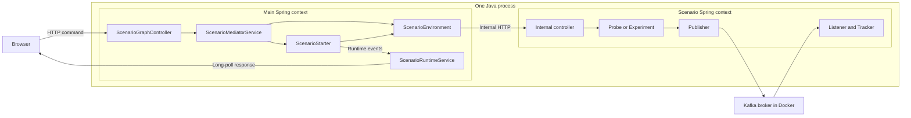

# How the scenario platform works

[Русский](platform-architecture.ru.md)

This article is a route through the application itself: what Spring creates,
who invokes a scenario, where observations are stored, and how they become
animation. Use [README](../README.md) for setup and the [scenario index](README.md)
for individual experiments.

## One JVM, several Spring contexts

[`SandboxApplication.main()`](../src/main/java/io/drozda/sandbox/SandboxApplication.java#L9) starts the main Spring Boot application. Its context
contains the platform REST controller, catalog, mediator, runtime service, and
implementations of [`ScenarioEnvironment`](../src/main/java/io/drozda/sandbox/scenario/spi/ScenarioEnvironment.java#L5) and [`ScenarioStarter`](../src/main/java/io/drozda/sandbox/scenario/spi/ScenarioStarter.java#L9). The application
also serves HTML, CSS, and JavaScript. The Kafka broker runs separately in Docker Compose.

On Play, an environment object creates another Spring Boot context in **the same
JVM**, with its own beans and embedded HTTP server. The code uses
`new SpringApplicationBuilder(ScenarioApplication.class)`, without `.child()` or
`.parent()`. “Nested” means managed from the main application; it does not mean an
automatic Spring parent/child context hierarchy.

The Kafka arrows apply to experiments 002–012. Scenario 001 uses a probe and sends
no test message. Separate contexts do not provide process isolation: all share
one JVM's resources.

## The platform's two interfaces

`ScenarioEnvironment` manages lifecycle:

| Method | Caller and result |
| --- | --- |
| `scenarioId()` | The mediator finds the environment by its stable scenario ID. |
| `start()` | Creates the context if absent; returns `ScenarioEnvironmentStatus`. |
| `stop()` | Closes the context and returns stopped environment status. |
| `reset()` | Resets experiment state; each implementation defines what to clear. |
| `status()` | Returns the current environment state. |

`ScenarioStarter` runs commands and presents their results:

| Method | Purpose |
| --- | --- |
| `scenarioId()` | Matches the environment and catalog ID. |
| `commands()` | Returns `ScenarioCommand` entries with ID, label, and description. |
| `execute(commandId, invocationName)` | Runs a command and returns active runtime state. |
| `execute(commandId, invocationName, parameters)` | Parameterized variant; its default delegates to the two-argument method. |
| `supports(commandId)` | Checks membership in `commands()`; the mediator does not use it as a central validator. |

Spring injects lists of all starters and environments into [`ScenarioMediatorService`](../src/main/java/io/drozda/sandbox/mediator/ScenarioMediatorService.java#L18).
The mediator selects them by `scenarioId()`. `runDefault()` chooses the first
command; `execute()` calls `startEnvironment()` before invoking the starter.
Concrete starters interpret parameters such as `keyStrategy` and `topology`.

Experiment, Publisher, and Tracker have no shared platform interfaces today.
They are experiment-specific classes. Scenarios need not have identical class
structures: 001 uses a probe without a Kafka experiment.

## Step by step: Play in 001 System Ready

1. The browser calls [`runScenario()`](../src/main/resources/static/app.js#L138), clears the selected local timeline, enables
   autoplay, and sends `POST /api/scenarios/system-ready/run` with a run name.
2. [`ScenarioGraphController.runScenario()`](../src/main/java/io/drozda/sandbox/visualization/ScenarioGraphController.java#L167) forwards the request to the mediator.
3. The mediator finds [`SystemReadyEnvironment`](../src/main/java/io/drozda/sandbox/scenario/systemready/SystemReadyEnvironment.java#L36) and calls `start()`.
4. The environment calls `SpringApplicationBuilder.run()` for
   [`SystemReadyScenarioApplication`](../src/main/java/io/drozda/sandbox/scenario/systemready/app/SystemReadyScenarioApplication.java#L11) and stores the resulting
   `ConfigurableApplicationContext`. It reads the actual server port through
   `WebServerApplicationContext` and stores `baseUrl`. Scenario 001 supplies
   `.properties(...)` defaults; 002 passes arguments through
   `.run("--server.port=0", ...)`. Higher-priority configuration can override 001's defaults.
5. `SystemReadyScenarioApplication` imports the publisher, listener, probe, and
   internal controller. Spring creates their beans and injects dependencies.
6. [`SystemReadyScenarioStarter.execute()`](../src/main/java/io/drozda/sandbox/scenario/systemready/SystemReadyScenarioStarter.java#L51) calls
   `SystemReadyEnvironment.baselineReadiness()`, which makes an internal HTTP
   request to `/internal/system-ready/commands/baseline-readiness`.
7. [`SystemReadyScenarioController`](../src/main/java/io/drozda/sandbox/scenario/systemready/app/SystemReadyScenarioController.java#L34) obtains three facts from [`SystemReadyProbe`](../src/main/java/io/drozda/sandbox/scenario/systemready/SystemReadyProbe.java#L27):
   whether publisher, listener, and `KafkaTemplate` exist. It returns
   `SystemReadyScenarioStatus`.
8. The starter starts a runtime session, emits component-readiness events, and
   completes the session. Short `pause()` calls pace the presentation.

After step 8, the scenario context **keeps running**. Neither experiment completion
nor animation completion calls `close()`. Green components in 001 mean bean
presence; the broker has not been checked.

## Where actual Kafka events appear: scenario 002

[`TradeFlowExperiment.run()`](../src/main/java/io/drozda/sandbox/scenario/tradeeventflow/app/TradeFlowExperiment.java#L27) creates an event with a unique `eventId` and first
registers a wait through [`TradeFlowEventTracker.expect()`](../src/main/java/io/drozda/sandbox/scenario/tradeeventflow/app/TradeFlowEventTracker.java#L13). Then
[`TradeFlowPublisher.publish()`](../src/main/java/io/drozda/sandbox/scenario/tradeeventflow/producer/TradeFlowPublisher.java#L20) calls `KafkaTemplate.send()` and returns a future.
The experiment waits for broker acknowledgement and obtains partition/offset metadata.

Independently of the HTTP thread, a Kafka listener container invokes
[`TradeFlowListener.onEvent()`](../src/main/java/io/drozda/sandbox/scenario/tradeeventflow/consumer/TradeFlowListener.java#L16) on its own thread. The listener passes the event to
the tracker; `received()` finds and completes the future by `eventId`. The
experiment waits separately for this result and returns status. The 002 tracker
uses `ConcurrentHashMap` because the HTTP and listener threads work concurrently.

An old event must not complete a new experiment, so a unique-ID wait is registered
**before** sending. Other trackers also capture callback order, partition ownership,
or processing completion time. These observations are what experiments verify.

## Kafka records and UI events are different streams

A Kafka record is experiment data. A runtime event describes an observed fact for
the visualizer: component readiness, signal movement, or a node-detail change.
The listener does not send messages directly to the browser or publish the UI
timeline to Kafka.

The starter receives experiment results and calls [`ScenarioRuntimeService`](../src/main/java/io/drozda/sandbox/visualization/ScenarioRuntimeService.java#L162)
directly. `applyRuntimeEvent()` updates status maps and signals. [`publishRuntime()`](../src/main/java/io/drozda/sandbox/visualization/ScenarioRuntimeService.java#L270)
stores the previous snapshot, increments the revision, and appends a
`ScenarioTimelineEvent` with `before`, `after`, `visibleInTimeline`, `animated`,
and optional `playbackGroup`. It then completes waiting long polls. The
`/runtime/event` endpoint also exists, but starters in the main context can use
ordinary Java service calls.

| Storage | Contents and lifetime |
| --- | --- |
| Kafka topic | Experiment records, independent of the UI/current consumer, subject to broker data lifecycle. |
| Scenario tracker | Waits, callbacks, and observations; cleared by the particular reset/experiment implementation. |
| Backend runtime | One shared active snapshot, up to 1000 in-memory transitions, and the latest 24 runtime log lines. |
| Browser timeline | Events and frames per scenario; a new Play clears the selected timeline, reload clears local history. |

The browser reads `/runtime/head`, then keeps a request to
`/runtime/updates?after=<revision>` open. [`awaitRuntimeUpdate()`](../src/main/java/io/drozda/sandbox/visualization/ScenarioRuntimeService.java#L72) uses
`DeferredResult`, releasing the servlet thread while it waits for changes.
Experiment execution and internal HTTP calls remain synchronous: long polling
does not make the entire platform asynchronous.

[`receiveTimelineEvents()`](../src/main/resources/static/app.js#L213) deduplicates by sequence and builds frames. Events with
a shared `playbackGroup` can share a frame; hidden technical updates are folded
into its final state. [`showTimelineStep()`](../src/main/resources/static/app.js#L281) presents the initial snapshot,
transition, and final state. The backend can finish while the UI is still
explaining the first steps. Replay sends no new Kafka records.

## Stop and the next Play

[`stopScenario()`](../src/main/resources/static/app.js#L171) pauses playback and sends
`POST /api/scenarios/{id}/environment/stop`. The controller calls the mediator,
which calls `environment.stop()`. In 001, this calls `applicationContext.close()`
and clears `applicationContext` and `baseUrl`.

Closing the context runs bean lifecycle shutdown, stopping its listener containers
and embedded web server. The main Spring context stays alive: the page, catalog,
mediator, and runtime API remain available. The controller clears the active visual
session and resets its step; the browser clears local state after the response.
The next Play creates a new scenario context.

Stop neither stops the Docker broker nor deletes topics. Reset is not Kafka-data
cleanup either. The UI disables Stop while a run request is in flight; it is not
an emergency cancellation mechanism for a stuck experiment.

In 001–009, repeated Play normally reuses the open context. In 010–012, experiment
entry points explicitly stop/start the context to create new topics and groups.
Page/scenario navigation is not Stop and must not be assumed to close the previous
context. All contexts disappear when the process exits; the mediator has no
central shutdown hook that walks its environments and calls `stop()`. Explicit
Stop is the supported path for closing an individual scenario environment.

## Exploring and extending the platform

Start with 001 and follow `runDefault → start → execute → baselineReadiness →
applyRuntimeEvent` in the debugger. Then add 002's `expect → publish → onEvent →
received` path. This separates platform lifecycle from asynchronous Kafka delivery.

A new experiment needs consistent IDs in catalog, environment, and starter;
scenario application configuration; an internal command; and an observable result.
Add each node's key locations to [`ScenarioSourceCatalog`](../src/main/java/io/drozda/sandbox/visualization/ScenarioSourceCatalog.java#L9) and explain the Kafka
behavior in a scenario article. Checks should verify observations, not just green
colors. Examples include [`AllComponentsTest`](../src/test/java/io/drozda/sandbox/basic/AllComponentsTest.java#L37), [`TradeFlowScenarioTest`](../src/test/java/io/drozda/sandbox/scenario/tradeeventflow/TradeFlowScenarioTest.java#L21), and
[`ScenarioRuntimeServiceTest`](../src/test/java/io/drozda/sandbox/visualization/ScenarioRuntimeServiceTest.java#L17).

Current boundaries are a shared active runtime session, in-memory history,
a bounded journal without an explicit cursor-gap response, and HTTP within one
JVM. This is a learning environment, not an isolated-process execution service.
