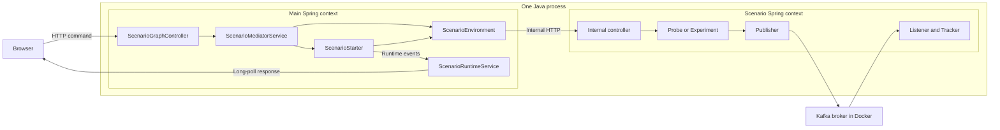

# Как устроена платформа сценариев

[English](platform-architecture.en.md)

Эта статья — маршрут исследования самого приложения: что создаёт Spring, кто
вызывает сценарий, где хранятся наблюдения и как они превращаются в анимацию.
Для запуска используйте [README](../README.md), для отдельных опытов —
[каталог сценариев](README.md).

## Одна JVM, несколько Spring contexts

[`SandboxApplication.main()`](../src/main/java/io/drozda/sandbox/SandboxApplication.java#L9) запускает основное Spring Boot приложение. Его context
содержит REST controller платформы, catalog, mediator, runtime service и реализации
[`ScenarioEnvironment`](../src/main/java/io/drozda/sandbox/scenario/spi/ScenarioEnvironment.java#L5) и [`ScenarioStarter`](../src/main/java/io/drozda/sandbox/scenario/spi/ScenarioStarter.java#L9). Это же приложение отдаёт HTML, CSS и JS
браузеру. Kafka broker запущен отдельно через Docker Compose.

При Play объект environment создаёт ещё один Spring Boot context в **той же JVM**.
У сценарного context собственные бины и embedded HTTP server. В коде используется
`new SpringApplicationBuilder(ScenarioApplication.class)`, а не `.child()` или
`.parent()`: «вложенный» здесь означает управляемый из основного приложения,
а не автоматически созданную иерархию Spring parent/child contexts.

Стрелки Kafka относятся к опытам 002–012. В 001 используется probe: реальную
отправку сообщения этот сценарий не выполняет. Отдельный context также не даёт
изоляции процесса: все contexts используют общие ресурсы одной JVM.

## Два интерфейса платформы

`ScenarioEnvironment` отвечает за жизненный цикл:

| Метод | Кто вызывает и что получает |
| --- | --- |
| `scenarioId()` | Mediator находит environment по стабильному ID сценария. |
| `start()` | Создаёт сценарный context, если его ещё нет; возвращает `ScenarioEnvironmentStatus`. |
| `stop()` | Закрывает context и возвращает состояние остановленного окружения. |
| `reset()` | Сбрасывает состояние опыта; конкретная реализация решает, что очищать. |
| `status()` | Возвращает текущее состояние окружения. |

`ScenarioStarter` отвечает за запуск команды и представление результата:

| Метод | Назначение |
| --- | --- |
| `scenarioId()` | Связывает starter с тем же ID, что у environment и catalog. |
| `commands()` | Возвращает список `ScenarioCommand`: ID, название и описание команды. |
| `execute(commandId, invocationName)` | Выполняет команду и возвращает активное runtime-состояние. |
| `execute(commandId, invocationName, parameters)` | Вариант с параметрами; default-реализация делегирует двухаргументному методу. |
| `supports(commandId)` | Проверяет наличие команды в `commands()`; mediator не использует его как центральный валидатор. |

Spring внедряет в [`ScenarioMediatorService`](../src/main/java/io/drozda/sandbox/mediator/ScenarioMediatorService.java#L18) списки всех starters и environments.
Mediator выбирает их по `scenarioId()`. `runDefault()` берёт первую команду из
`commands()`, а `execute()` сначала вызывает `startEnvironment()`, затем starter.
Параметры вроде `keyStrategy` и `topology` интерпретируют конкретные starters.

Общего интерфейса для Experiment, Publisher или Tracker сейчас нет: это классы
конкретного опыта. Не каждый сценарий обязан иметь одинаковый набор классов;
например, 001 обходится probe без Kafka experiment.

## Пошагово: Play в 001 System Ready

1. Браузер вызывает [`runScenario()`](../src/main/resources/static/app.js#L138): очищает локальную timeline выбранного сценария,
   включает автоматическое воспроизведение и отправляет
   `POST /api/scenarios/system-ready/run` с именем запуска.
2. [`ScenarioGraphController.runScenario()`](../src/main/java/io/drozda/sandbox/visualization/ScenarioGraphController.java#L167) передаёт запрос в mediator.
3. Mediator находит [`SystemReadyEnvironment`](../src/main/java/io/drozda/sandbox/scenario/systemready/SystemReadyEnvironment.java#L35) и вызывает `start()`.
4. Environment запускает [`SystemReadyScenarioApplication`](../src/main/java/io/drozda/sandbox/scenario/systemready/app/SystemReadyScenarioApplication.java#L12) через
   `SpringApplicationBuilder.run()` и сохраняет `ConfigurableApplicationContext`.
   Созданный HTTP-порт читается из `WebServerApplicationContext`, а адрес сохраняется
   в `baseUrl`. Настройки передаются аргументами `.run(...)`: флаг
   `scenario.system-ready.enabled=true`, случайный HTTP-порт, уникальные topic/group
   и JSON-настройки модели из `scenario.systemready.model`.
5. `SystemReadyScenarioApplication` импортирует publisher, listener, probe и
   внутренний controller. Условная конфигурация включается только флагом сценария.
   Publisher, listener и probe не имеют component-аннотаций; основной context
   не создаёт их при сканировании. Listener объявлен с `autoStartup=false`: проверка
   wiring не подписывается на broker.
6. [`SystemReadyScenarioStarter.execute()`](../src/main/java/io/drozda/sandbox/scenario/systemready/SystemReadyScenarioStarter.java#L51) вызывает
   `SystemReadyEnvironment.baselineReadiness()`. Environment отправляет внутренний
   HTTP-запрос в `/internal/system-ready/commands/baseline-readiness`.
7. [`SystemReadyScenarioController`](../src/main/java/io/drozda/sandbox/scenario/systemready/app/SystemReadyScenarioController.java#L36) получает из [`SystemReadyProbe`](../src/main/java/io/drozda/sandbox/scenario/systemready/SystemReadyProbe.java#L25) три факта:
   присутствуют ли publisher, listener и `KafkaTemplate`. Возвращается
   `SystemReadyScenarioStatus`.
8. Starter создаёт runtime-сессию, публикует события готовности компонентов и
   завершает сессию. Короткие `pause()` здесь нужны для представления результата.

После шага 8 сценарный context **продолжает работать**. Завершение опыта или
анимации не вызывает `close()`. В 001 зелёные компоненты означают наличие бинов;
Kafka broker при этом не проверен.

## Где появляются настоящие Kafka-события: пример 002

[`TradeFlowExperiment.run()`](../src/main/java/io/drozda/sandbox/scenario/tradeeventflow/app/TradeFlowExperiment.java#L27) создаёт событие с уникальным `eventId` и сначала
регистрирует ожидание через [`TradeFlowEventTracker.expect()`](../src/main/java/io/drozda/sandbox/scenario/tradeeventflow/app/TradeFlowEventTracker.java#L13). Затем
[`TradeFlowPublisher.publish()`](../src/main/java/io/drozda/sandbox/scenario/tradeeventflow/producer/TradeFlowPublisher.java#L20) вызывает `KafkaTemplate.send()` и возвращает future.
Experiment ждёт broker acknowledgement и получает partition/offset.

Независимо от HTTP-потока, Kafka listener container вызывает
[`TradeFlowListener.onEvent()`](../src/main/java/io/drozda/sandbox/scenario/tradeeventflow/consumer/TradeFlowListener.java#L16) в своём потоке. Listener передаёт событие в tracker;
`received()` находит future по `eventId` и завершает его. Experiment отдельно
дожидается этого результата и возвращает status. В 002 tracker использует
`ConcurrentHashMap`: HTTP-поток и listener работают одновременно.

Старое событие не должно завершать новый опыт, поэтому ожидание регистрируется
по уникальному ID **до** отправки. В других сценариях trackers дополнительно
сохраняют callback-order, ownership partitions или время завершения обработки.
Именно эти наблюдения проверяет experiment.

## Kafka records и события UI — два разных потока

Kafka record — данные опыта. Runtime event — описание подтверждённого факта для
визуализатора: «компонент готов», «началось движение сигнала», «обновился текст узла».
Listener не отправляет сообщения прямо в браузер и не публикует UI timeline в Kafka.
Старый `@VisualAction` и его AOP-аспект удалены: они только писали лог вокруг
метода publisher и никогда не формировали runtime-события.

Starter получает результат опыта и вызывает [`ScenarioRuntimeService`](../src/main/java/io/drozda/sandbox/visualization/ScenarioRuntimeService.java#L162) напрямую.
`applyRuntimeEvent()` обновляет карты статусов и список сигналов.
[`publishRuntime()`](../src/main/java/io/drozda/sandbox/visualization/ScenarioRuntimeService.java#L270) сохраняет предыдущий snapshot, увеличивает revision и добавляет
`ScenarioTimelineEvent` с `before`, `after`, `visibleInTimeline`, `animated` и
необязательным `playbackGroup`. Затем завершаются ожидающие long-poll запросы.
Endpoint `/runtime/event` тоже существует, но starters внутри основного context
могут вызывать сервис обычным Java-вызовом.

| Хранилище | Что там лежит и как долго |
| --- | --- |
| Kafka topic | Records опыта; живут независимо от UI и текущего consumer, в пределах жизненного цикла данных broker. |
| Tracker сценария | Ожидания, callbacks и наблюдения опыта; очищаются согласно реализации reset/experiment. |
| Backend runtime | Один общий активный snapshot, до 1000 переходов в памяти и последние 24 строки runtime log. |
| Browser timeline | Полученные события и кадры по сценариям; новый Play очищает выбранную timeline, reload очищает локальную историю. |

Браузер сначала читает `/runtime/head`, затем держит запрос
`/runtime/updates?after=<revision>`. [`awaitRuntimeUpdate()`](../src/main/java/io/drozda/sandbox/visualization/ScenarioRuntimeService.java#L72) использует `DeferredResult`:
пока изменений нет, servlet-поток не занят ожиданием ответа. При этом сам запуск
experiment и внутренние HTTP-вызовы остаются синхронными — long polling не делает
всю платформу асинхронной.

[`receiveTimelineEvents()`](../src/main/resources/static/app.js#L213) удаляет дубликаты по sequence и собирает кадры. События
с одним `playbackGroup` могут объединяться в кадр; скрытые технические изменения
добавляются к итоговому состоянию. [`showTimelineStep()`](../src/main/resources/static/app.js#L281) показывает начальный
snapshot, движение и конечное состояние. Поэтому backend уже может закончить
опыт, пока UI ещё объясняет его первые шаги. Replay не отправляет новые records.

## Что происходит при Stop и следующем Play

[`stopScenario()`](../src/main/resources/static/app.js#L171) приостанавливает проигрывание и отправляет
`POST /api/scenarios/{id}/environment/stop`. Controller вызывает mediator, тот —
`environment.stop()`. В 001 это `applicationContext.close()`, затем обнуление
`applicationContext` и `baseUrl`.

Закрытие context завершает жизненный цикл его бинов, останавливает listener
containers и embedded web server. Основной Spring context остаётся работать:
страница, catalog, mediator и runtime API доступны. Controller очищает активную
визуальную сессию и сбрасывает шаг; браузер очищает локальное состояние после ответа.
Следующий Play создаёт новый сценарный context.

Stop не останавливает Docker broker и не удаляет topics. Reset также не является
командой удаления Kafka-данных. В UI Stop отключён, пока run-запрос выполняется:
это не механизм аварийного прерывания зависшего опыта.

В 001–009 повторный Play обычно использует уже открытый context. В 010–012 методы
запуска опыта явно вызывают stop/start, чтобы создать новые topics и groups.
Смена страницы или сценария не равна Stop: нельзя считать, что навигация закрыла
предыдущий context. При завершении процесса исчезают все contexts; отдельного
централизованного shutdown-hook, который обходит environments и вызывает `stop()`,
в mediator нет. Для штатного завершения отдельного опыта предусмотрен явный Stop.

## Как исследовать и расширять платформу

Начните с 001 и пройдите debugger-ом `runDefault → start → execute →
baselineReadiness → applyRuntimeEvent`. Затем добавьте в маршрут 002:
`expect → publish → onEvent → received`. Это отделяет жизненный цикл платформы
от асинхронной доставки Kafka.

Для нового опыта нужны согласованные ID в catalog, environment и starter,
конфигурация сценарного приложения, внутренняя команда и наблюдаемый результат.
В [`ScenarioSourceCatalog`](../src/main/java/io/drozda/sandbox/visualization/ScenarioSourceCatalog.java#L9) укажите ключевые места для каждого узла; отдельная
статья описывает Kafka-смысл опыта. Проверки должны подтверждать наблюдения, а не
только зелёный цвет. Примеры — [`AllComponentsTest`](../src/test/java/io/drozda/sandbox/basic/AllComponentsTest.java#L25), [`TradeFlowScenarioTest`](../src/test/java/io/drozda/sandbox/scenario/tradeeventflow/TradeFlowScenarioTest.java#L21) и
[`ScenarioRuntimeServiceTest`](../src/test/java/io/drozda/sandbox/visualization/ScenarioRuntimeServiceTest.java#L17).

Текущие границы платформы: одна общая активная runtime-сессия, память без постоянного
хранилища истории, ограниченный журнал без явного cursor-gap ответа, HTTP внутри
одной JVM. Это учебный стенд, а не система запуска изолированных процессов.
